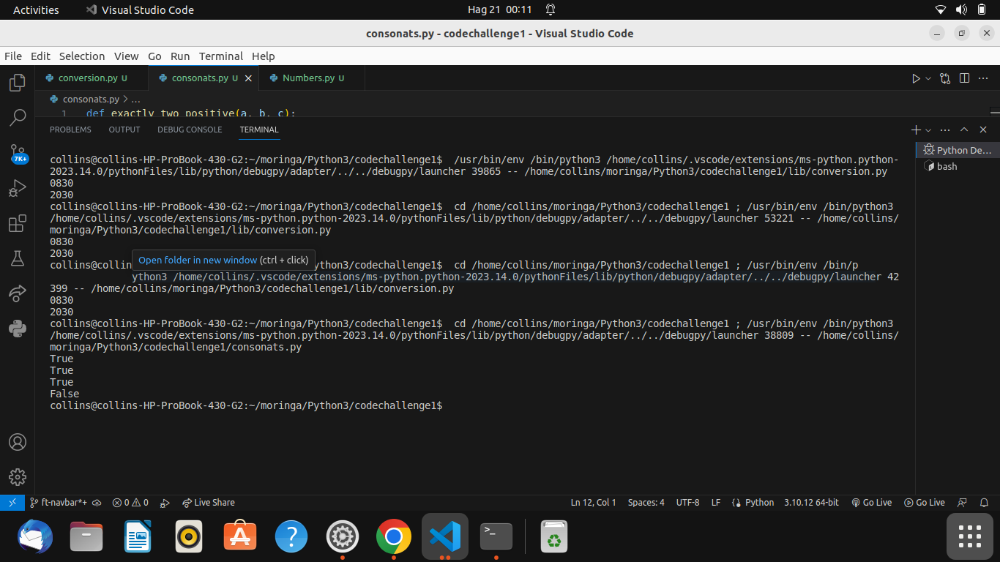
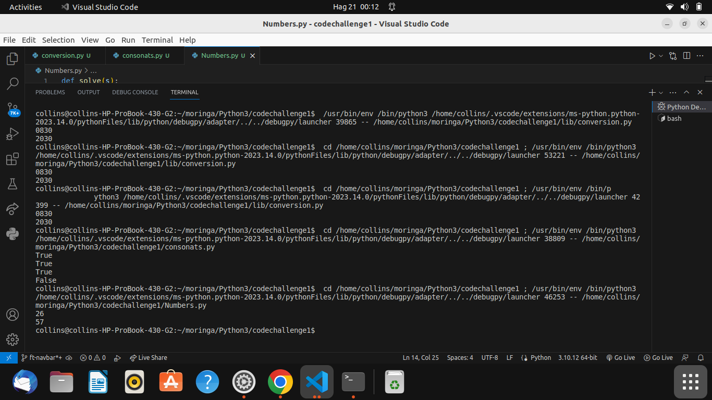

## Phase one Project
## Author- Collins Kipkorir
## LASOI BOOK POINT
Lasoi Book Point is a web application that allows users to browse and search for books, view book details, and add books to their cart for purchase. Users can also check the availability of books and view their prices. The application provides a user-friendly interface for an enjoyable book browsing and shopping experience.
## Development server
Run  json-server --watch db.json serve for a dev server. Navigate to http://localhost:3000/books. The app will automatically reload if you change any of the source files.
## SCREENSHOTS OF THE BLISS MOVIE-THEATER WEB

## Known Bugs
The bug available is that when you search a book it will load all books having the letters you wrote and will display vertically overlapping with other cards and items.Also it lacks to display on the cart icon when you add a book to cart.
## Support and contact details 
To make a contribution to the code used or any suggestions you can click on the contact link and email me your suggestions.
    • Email: kipkorirc583@gmail.com
## License
 Copyright (c) 2023 Collins Kipkorir.

Permission is hereby granted, free of charge, to any person obtaining a copy of this software and associated documentation files , to deal in the Software without restriction, including without limitation the rights to use, copy, modify, merge, publish, distribute, sublicense, and/or sell copies of the Software, and to permit persons to whom the Software is furnished to do so, subject to the following conditions:
The above copyright notice and this permission notice shall be included in all copies or substantial portions of the Software.
THE SOFTWARE IS PROVIDED "AS IS", WITHOUT WARRANTY OF ANY KIND, EXPRESS OR IMPLIED, INCLUDING BUT NOT LIMITED TO THE WARRANTIES OF MERCHANTABILITY, FITNESS FOR A PARTICULAR PURPOSE AND NONINFRINGEMENT. IN NO EVENT SHALL THE AUTHORS OR COPYRIGHT HOLDERS BE LIABLE FOR ANY CLAIM, DAMAGES OR OTHER LIABILITY, WHETHER IN AN ACTION OF CONTRACT, TORT OR OTHERWISE, ARISING FROM, OUT OF OR IN CONNECTION WITH THE SOFTWARE OR THE USE OR OTHER DEALINGS IN THE SOFTWARE.
# challenge1
