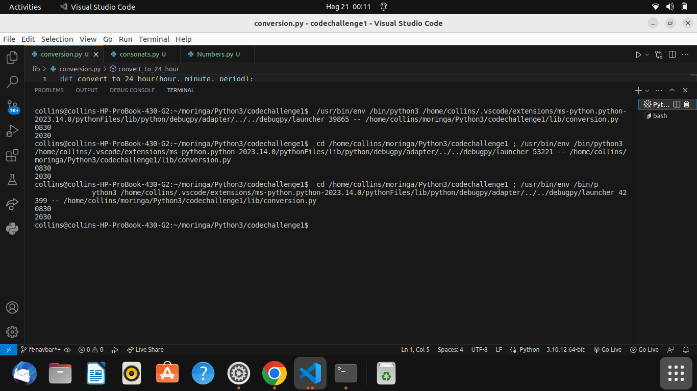

## Code challenge 1 
## Author- Collins Kipkorir
##  CHALLENGE 1
We are coverting 12hr clock into 24 hrs sytem

## CHALLENGE2
In this challenge, you are given three integers: a, b, and c. Your task is to determine whether exactly two of these three integers are positive numbers (greater than zero). If exactly two of them are positive, the function should return True; otherwise, it should return False.

## SCREENSHOTS OF THE BLISS MOVIE-THEATER WEB

## CHALLENGE 3
You are given a lowercase string containing only alphabetic characters and no spaces. Your task is to return the highest value of consonant substrings in the string. Consonants are any letters of the alphabet except "aeiou". Each consonant has a corresponding value: a = 1, b = 2, c = 3, ..., z = 26.

You need to find all consonant substrings in the string and calculate their values. The highest value among these consonant substrings should be returned.

## Support and contact details 
To make a contribution to the code used or any suggestions you can click on the contact link and email me your suggestions.
    • Email: kipkorirc583@gmail.com
## License
 Copyright (c) 2023 Collins Kipkorir.

Permission is hereby granted, free of charge, to any person obtaining a copy of this software and associated documentation files , to deal in the Software without restriction, including without limitation the rights to use, copy, modify, merge, publish, distribute, sublicense, and/or sell copies of the Software, and to permit persons to whom the Software is furnished to do so, subject to the following conditions:
The above copyright notice and this permission notice shall be included in all copies or substantial portions of the Software.
THE SOFTWARE IS PROVIDED "AS IS", WITHOUT WARRANTY OF ANY KIND, EXPRESS OR IMPLIED, INCLUDING BUT NOT LIMITED TO THE WARRANTIES OF MERCHANTABILITY, FITNESS FOR A PARTICULAR PURPOSE AND NONINFRINGEMENT. IN NO EVENT SHALL THE AUTHORS OR COPYRIGHT HOLDERS BE LIABLE FOR ANY CLAIM, DAMAGES OR OTHER LIABILITY, WHETHER IN AN ACTION OF CONTRACT, TORT OR OTHERWISE, ARISING FROM, OUT OF OR IN CONNECTION WITH THE SOFTWARE OR THE USE OR OTHER DEALINGS IN THE SOFTWARE.
